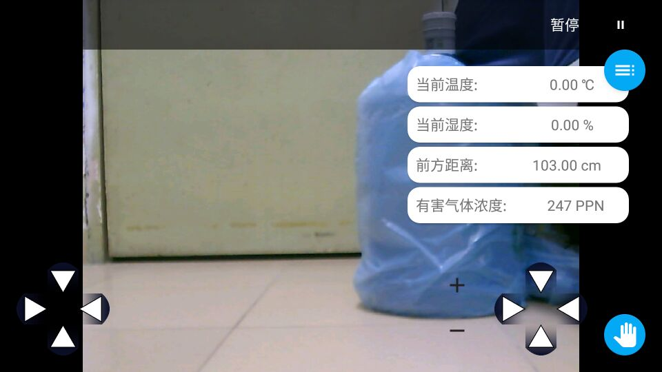
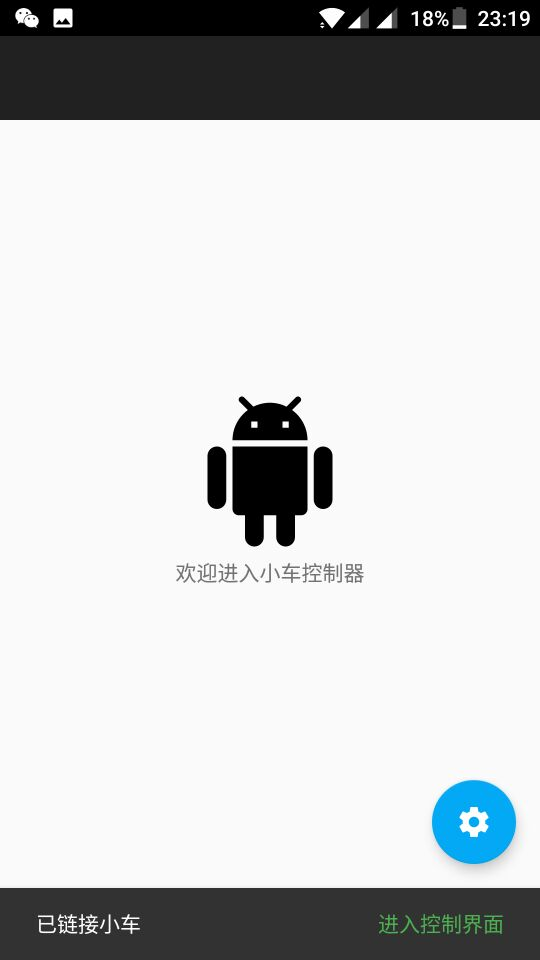
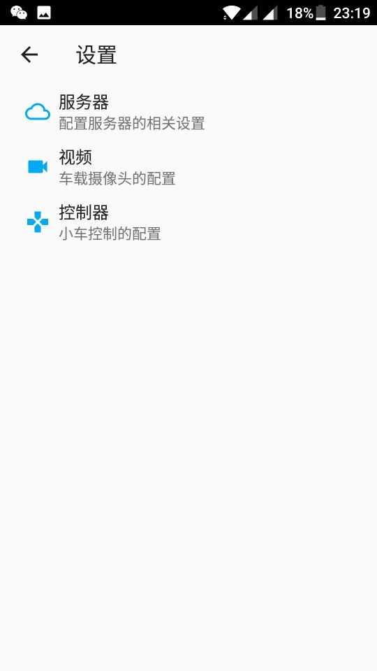

# RobotControler
<h4>基于MjpegInputStream和Socket通信的Android小车控制端</h4>
<h4>使用了MVP的开发模式，Activity + Fragment。</h4>
<h2>服务器模块</h2>
<h4>使用了搭载OpenWrt系统的TP-Link WR703N作为中间数据传输介质</h4>
<h2>视频模块</h2>
<h4>OpenWrt：mjpg-streamer、kmod-video-uvc</h4>
<h4>Android：MjpegSurfaceView + MjpegInputStream</h4>
<h2>控制模块</h2>
<h4>OpenWrt：ser2net、minicom</h4>
<h4>Android：需要将十六进制的字符串hexString转换为字节流Bytes，然后OutputStream.write().flush()即可</h4>
<h2>截图</h2>

